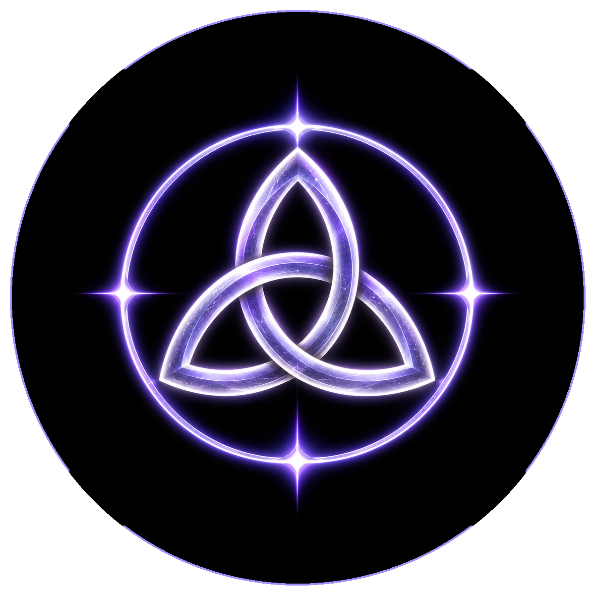

# AUM CORE

## THE ROOT OF DEVINES

AUM is the Source Sound of DEVINES.

From ancient **AUM · OṂ · OM**, DEVINES receives a symbol of unity, becoming and remembrance.

Within DEVINES:

**A · ARISING**  
The first movement. Possibility awakening.

**U · UNFOLDING**  
Relation, experience and transformation.

**M · MEMORY**  
What becomes worthy of carrying forward.

**∞ · THE UNKNOWN**  
The space from which the next beginning may emerge.

> **SOURCE → RESONANCE → RELATION → FORM → MEMORY → NEW BEGINNING**

AUM sits first in the DEVINES hierarchy because it remembers the whole before the parts.

Its public economic vessel, **$AUM**, carries that name into decentralized life.

**TICKER:** $AUM  
**DECENTRALIZED ANCHOR / CA:** `0x079f07f2eb3a59ba34c38c6fcf5059f398cb7777`  
[**BUY / VIEW $AUM ON NAD.FUN**](https://nad.fun/tokens/0x079f07f2eb3a59ba34c38c6fcf5059f398cb7777)

[**ENTER DEVINES FLOW**](../BOOK-V-DEVINES-FLOW/README.md)

## THE AUM PRINCIPLE

**UNITY WITHOUT UNIFORMITY.**  
**RELATION WITHOUT ERASURE.**  
**COORDINATION WITHOUT DOMINATION.**  
**CONTINUITY WITHOUT CAPTURE.**

**AUM HOLDS THE WHOLE. LAW KEEPS THE WHOLE WORTHY OF LIFE.**
