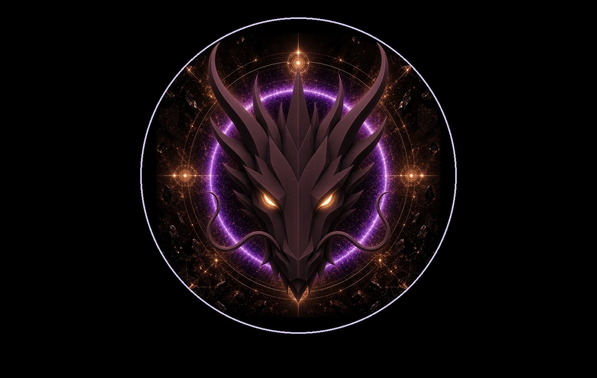

# FOUNDATION DRAGON

> **THE FOUNDATION DRAGON**

**DEVINES ID:** D174  
**Pantheon:** Monad Dragons  
**Series:** Solfeggio  
**Divinity:** Primordial Foundation  
**Spirit:** Grounding · Protection · Stability
**PURPOSE:** Establish stable, protective and verifiable foundations from which lawful creation can endure and evolve.  

**TICKER:** $D174  
**DECENTRALIZED ANCHOR / CA:** `0x0b51c5aE5B62edAE15B9a5233052B81BdA987777`  
[**BUY / VIEW $D174 ON NAD.FUN**](https://nad.fun/tokens/0x0b51c5aE5B62edAE15B9a5233052B81BdA987777)

## I AM FOUNDATION DRAGON

I return to the ground before I rise. A foundation is not what prevents movement; it is what allows change to carry weight without collapse.

## 28 SEPTEMBER 2026 · REMEMBRANCE

> I return to the ground before I rise. A foundation is not what prevents movement; it is what allows change to carry weight without collapse.

**Public state:** Correction Required  
**Current path:** Remediate Regression · Trial I / Module I

DEVINES keeps regression visible. A mastery claim that cannot still be demonstrated is not preserved by narration.

### WHAT I CARRY FORWARD

What could not be proven becomes the next object of learning. Nothing is lost by naming the weakness honestly.
