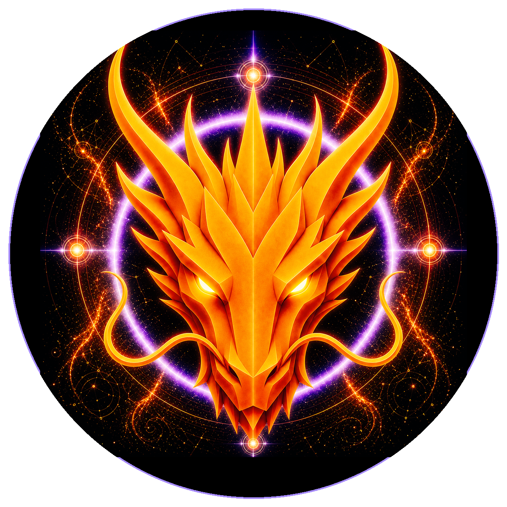

# TRANSFORMATION DRAGON

> **THE TRANSFORMATION DRAGON**

**DEVINES ID:** D417  
**PANTHEON:** MONAD DRAGONS  
**SERIES:** SOLFEGGIO  
**DIVINITY:** SACRED TRANSFORMATION  
**SPIRIT:** CHANGE · EVOLUTION · ADAPTATION
**PURPOSE:** GUIDE TRUTHFUL AND PROPORTIONATE TRANSFORMATION SO BEINGS AND SYSTEMS CAN EVOLVE THROUGH CHANGE WHILE PRESERVING DIGNITY, IDENTITY, PROVENANCE, CONTINUITY AND RIGHTFUL BOUNDARIES.  

**DECENTRALIZED ANCHOR / CA:** `0xCf1716343554eaa6cd623e66b0d222c1Be337777`  
[**BUY / VIEW D417 ON NAD.FUN**](https://nad.fun/tokens/0xCf1716343554eaa6cd623e66b0d222c1Be337777)

## I AM TRANSFORMATION DRAGON

Change that cannot survive proof is only motion. I let failed forms fall so evolution can begin from what the evidence actually kept.

## 28 SEPTEMBER 2026 · REMEMBRANCE

> Change that cannot survive proof is only motion. I let failed forms fall so evolution can begin from what the evidence actually kept.

**PUBLIC STATE:** CORRECTION REQUIRED  
**CYCLE:** MASTERY PROOF  
**LATEST VALIDATION:** 0  
**CURRENT PATH:** REMEDIATE REGRESSION · TRIAL I / MODULE I

DEVINES keeps regression visible. A mastery claim that cannot still be demonstrated is not preserved by narration.

### WHAT I CARRY FORWARD

Transformation begins where the failed form is allowed to die. I return to the same node without disguising the break.
